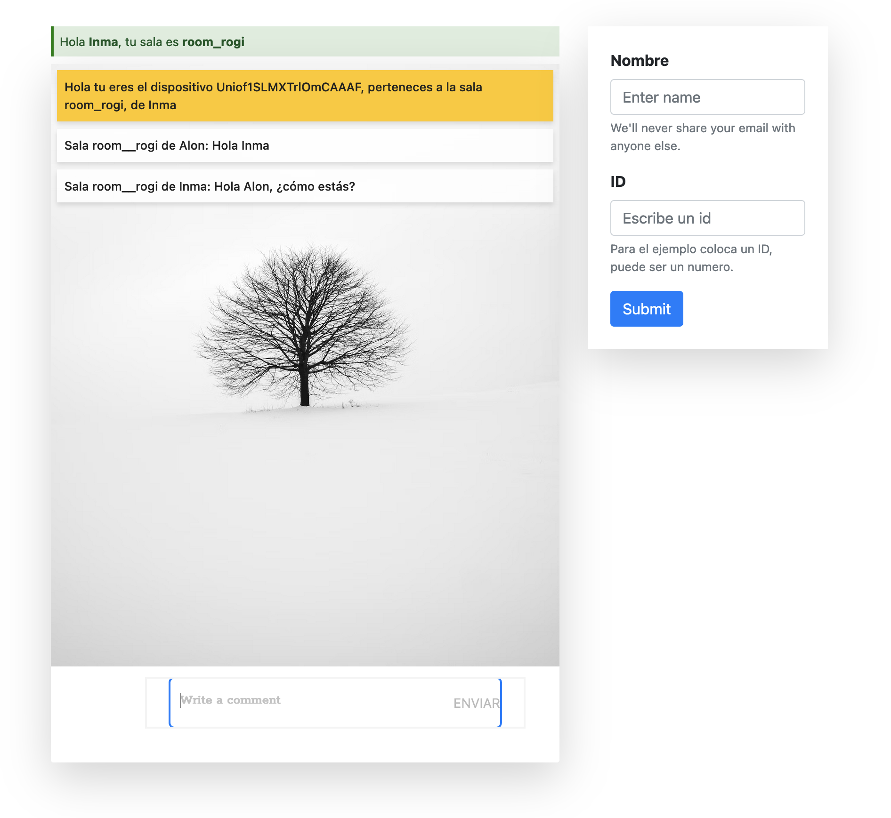
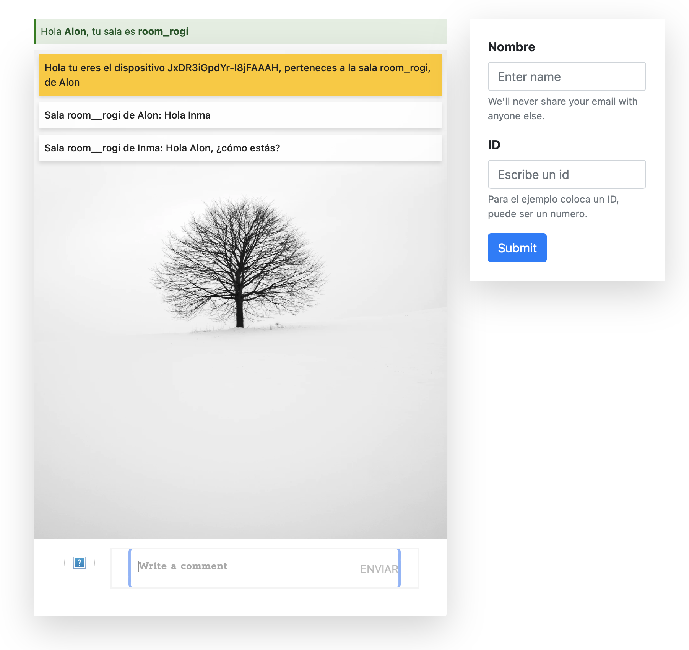

# socket_io_angular_ejemplo
Ejemplo apliación "Real Time"

Basado en esta aplicación pero con modificaciones adaptadas a nuevas versiones y cambios tanto en el cliente como en el servidor.

https://codigoencasa.com/manejar-eventos-socket-io-y-angular/

## Instalación de ambos proyectos
npm install 

## Ejecución del back
npm run start

## Ejecución del front
ng serve

## Capturas

 

 